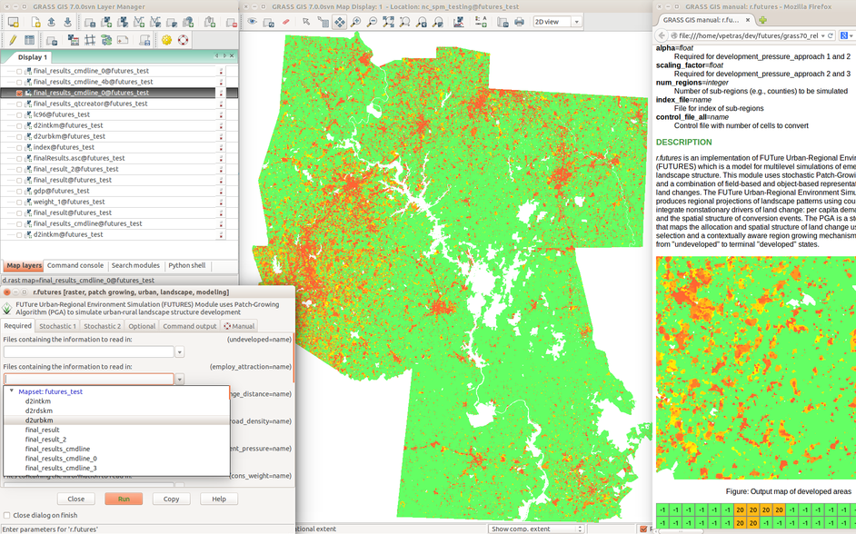

FUTURES in GRASS GIS
====================

This is a repository for FUTURES model port to GRASS GIS,
namely for r.futures module.

Getting r.futures
-----------------

Install GRASS GIS (http://grass.osgeo.org/) and then install an r.futures
from GRASS Addons using GUI or the following command:

    g.extension r.futures

Authors
-------

 * Ross K. Meentemeyer
 * Wenwu Tang
 * Monica A. Dorning
 * John B. Vogler
 * Nik J. Cunniffe
 * Douglas A. Shoemaker
 * Jennifer A. Koch
 * Vaclav Petras

See the GRASS module manual page for details and references.

License
-------

Copyright (C) 2013-2014 Meentemeyer et al.

This program is free software: you can redistribute it and/or modify
it under the terms of the GNU General Public License as published by
the Free Software Foundation, either version 2 of the License, or
(at your option) any later version.

This program is distributed in the hope that it will be useful,
but WITHOUT ANY WARRANTY; without even the implied warranty of
MERCHANTABILITY or FITNESS FOR A PARTICULAR PURPOSE. See the
GNU General Public License for more details.

See the LICENSE file for details.
