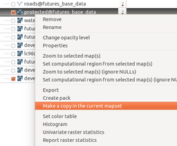
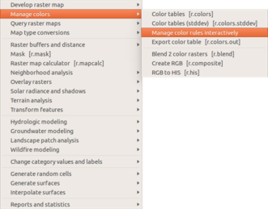
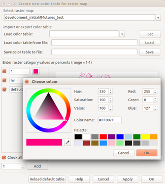
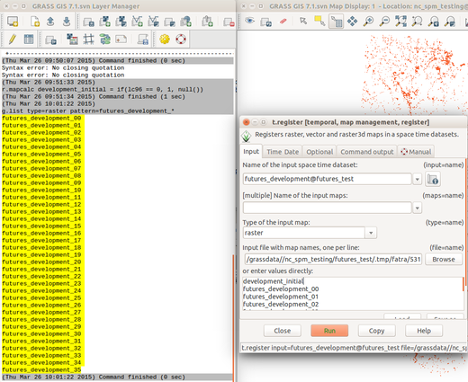
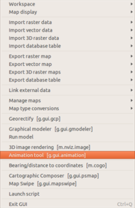
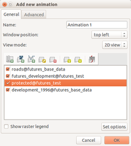
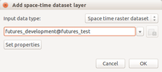
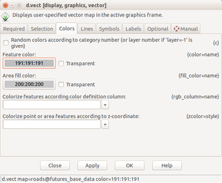
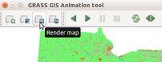

Creating animation for FUTURES output in GRASS GIS
==================================================

Convert the initial development into same classes as output from
``r.futures`` (1 for developed, NULL (NoData) for everything else,
for example::

    r.mapcalc "development_initial = if(lc96 == 0, 1, null())"

   A copy of a map from different Mapset can be created using context
   button of a layer in the Layer Manager

The colors for raster are typically managed when the raster is created,
so let's set the color table using interactive raster color management tool
(a wrapper around ``r.colors`` module).

   Finding manage color rules (color tables) in main menu

   Setting a color for a raster category using an interactive dialog

Create a spatio-temporal raster dataset::

    t.create output=futures_development type=strds temporaltype=absolute \
        semantictype=mean title="Development" \
        description="Development time series generated by FUTURES"

Note that backslashes mean that the line continues on the next line.
This syntax works in unix-like command lines.

Get list of all map layers in time series from ``r.futures``::

    g.list type=raster pattern=futures_development_*

This will create a list, add the initial development at the beginning::

    development_initial
    futures_development_00
    futures_development_01
    ...
    futures_development_33
    futures_development_34
    futures_development_35

You can prepare the list of rasters in a (plain) text editor and use the file as an input
but you can also use GUI dialog for ``t.register`` and copy and paste the list of rasters
from ``g.list`` directly into  and input the list 

If you will use GUI to create the command, it will look like this::

    t.register input=futures_development@futures_test \
        file=.../.tmp/fatra/5311.19 start=1996 unit=years increment=1

   Copying list of rasters from g.list to t.register GUI dialog

Start GRASS GIS Animation tool from main menu ``File > Animation Tool``
(or from command line ``g.gui.animation``).

   Animation tool in the main menu

   Managing layers of an animation

   Adding space time raster dataset as a layer which will be animated

The colors for vector are typically managed when displaying the layer
and this is also the case for roads vector.

   Vector layer properties and symbology dialog (d.vect module dialog)

Unlike other properties the opacity is managed separately in the list of layers.

Rendering animation takes some time and thus the rendering is not triggered automatically
when changing the size of the window. As a result, we need to press render button in toolbar
when we changed the size of the window.

   Animation needs to be re-rendered after resizing window using a button in toolbar

